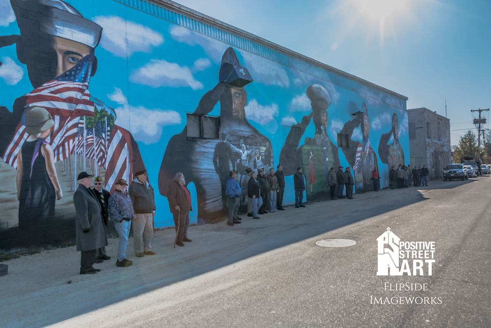

# A travel guide to Nashua, NH, USA

## AKA The Gate City

Hello, and welcome to the *gate city*. We are happy you are visiting. Nashua is a a half hour drive from Manchester, and an hour drive to Boston and Portsmouth. We're famous for having a [Dunder Mifflin](http://theoffice.wikia.com/wiki/Dunder_Mifflin_Nashua) branch in the show *The Office*. We were twice named one of the best places to live by [Money magazine](http://time.com/money/5108196/best-places-to-live-every-state-us/).

## Travel Tips

* We're only a half hour drive from the [Manchester Airport](https://www.flymanchester.com/). If you can, fly into Manchester. The airport is smaller, and the staff are friendly.
  * Parking in Manchester is only $10/day compared to Boston which is $70 for the first day, and $30 for each additional.
* We're about an hours drive from Boston's Logan airport.
* We have Uber, also Lyft. There tend to be more Uber drivers than Lyft.
* Cabs have to dispatched, you can't hail them.
* There are basically 3 areas of Nashua: Downtown, South Nashua, and North Nashua.
  * Most people in Nashua reference these places based on their exits on Route 3.
  * Downtown mostly has mom and pop stores (exits 4, 5, and 6)
  * South end has the mall (exits 1 and 2)
  * North end has a bunch of offices, and strip malls (exits 7 and 8)
* There are teal bikes for rent in town. [You can use an app to ride them around](https://www.veoride.com/).
* The busses are fantastic. View the [schedule online](https://www.nashuanh.gov/456/Routes-Schedules).

## Murals

The city of Nashua has a bunch of awesome murals. You can see where all the murals are in [this google map](https://www.google.com/maps/d/viewer?mid=1QDZzmmF54-I8nXO0vhxPcLkFig0&hl=en&ll=42.760100231886256%2C-71.46786625000004&z=16). Nashua's murals were made by [Positive Street Art](http://www.positivestreetart.org/), a really cool non-profit in town

## Coffee Land

We have quite a bit of coffee shops. However most of them close by 3. We have the standard Starbucks, and New Hampshire is known for loving [Dunkin dounuts](https://www.dunkindonuts.com/en). However these are the coffee shops in town, with great coffee and food.

* [Terragia](https://www.facebook.com/terragia/)
* [Bonhoeffers](http://www.bonhoefferscafe.com/)
* [Jaja Belles](https://www.jajabelles.com/blank-c13dw)
* [City Moose Cafe](http://www.citymoosenh.com/)
* [Pressed Cafe](http://www.pressedcafe.com/)
* [Great Harvest Bread Company](http://greatharvestnashua.com/)
* [Seedling Cafe](http://theseedlingcafe.com)
* [Riverwalk Cafe](https://riverwalknashua.com/)

## Bars

Nashua has a load of bars. Generally speaking they are open until 1am, and they are fantastic. This list will probably never be complete, but here are some local favorites.

* MT's Wine and bar
* The Peddler's Daughter
* Nashua Garden
* Codex
* O'briens
* San Francisco Kitchen
* Riverwalk cafe
* The Flight Center
* Fuego bar and grill
* Fody's Great American Tavern
* Stella Blu
* 110 Grill
* Martha's exchange

## Food

There is quite a large range of food given the size of the city. Many restaurants are also [coffee shops](#coffee-land). Nashua's restaurants usually fall into two categories. Places that close at 3pm, and places that open at 5pm. Eating between the hours of 3-5pm is quite hard. Outside of this list, there are many chain restaurants in town, and the food court in the mall is usually good.

### Breakfast

* Riverwalk Cafe
* Norton's Classic Cafe
* Midfield Cafe
* City Room Cafe
* Poor Pierre's
* Temple Street Diner
* Nancy's Diner
* City Moose Cafe

### Lunch

* Nashua Garden - Deli in a bar
* California Burrito
* Cedars Cafe - Mediterranean affair
* City moose cafe
* Crane - Chinese
* Fratello's - Italian
* Giant of Siam - Thai
* El Colima - Mexican
* Caza Mescal - Mexican
* City Room Cafe
* Poor Pierre's
* Temple Street diner
* Nancy's diner

### Dinner

* Stella Blu - Tapas in a bar setting
* Peddler's Daughter - Irish bar and food
* Riverwalk BBQ
* Surf - Seafood
* Martha's Exchange - American food, with beer brewed on site
* Fratello's - Italian

## Shopping

Incase you didn't know, New Hampshire has no sales tax! That means shopping doesn't come with extra costs. The [Pheasant lane mall](http://www.simon.com/mall/pheasant-lane-mall) is one of the largest malls in NH. The nearby [Merrimack outlets](http://www.premiumoutlets.com/outlet/merrimack) are home to several upscale outlet stores.

There are also several local businesses that are worth shopping at.

### Clothing

* [Fresh of nashua](http://www.freshofnashua.com/)
* Dick Avard's Haberdashery
* [camaraderie boutique](https://www.camaraderiestyle.com/)

### Furnature/Household

We have the standard Lowes, and Home Depot. Both of which are quite nice, but here are other places in town you may not think of.

## Great American Downtown

Nashua has a non-profit in town called [Great American Downtown](http://downtownnashua.org/) which is really focused on improving Nashua. They host, and coordinate many events in Nashua. [Their calendar](http://downtownnashua.org/events/) usually contains any events that are happening in town.
